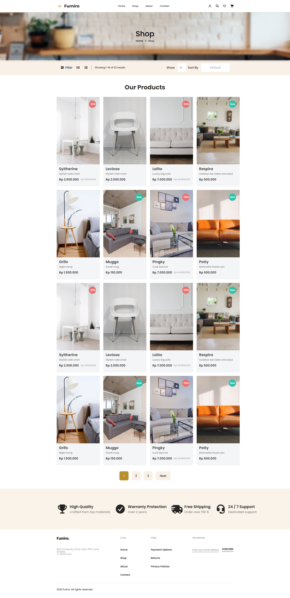

# 🛍️ Furniro – Furniture E-commerce Website

Furniro is a modern and clean **furniture e-commerce website UI** built using **HTML, CSS, and JavaScript**.  
It focuses on a smooth user experience, clean layout, and reusable UI components.

---

## 🚀 Live Demo

🌐 https://furnirofurnitureecom.netlify.app/

---

## 📸 Screenshots

### 🏠 Homepage


### 🛒 Shop Page


---

## 🌐 Pages

### 🏠 Home Page
- Hero section with CTA
- Category browsing (Dining, Living, Bedroom)
- Product grid with hover effects
- Inspiration slider
- Gallery section (#FuniroFurniture)

### 🛒 Shop Page
- Shop hero with breadcrumb
- Filter & sorting bar UI
- Product listing grid
- Pagination
- Feature highlights section

---

## ✨ Features

### 🧭 Navigation
- Desktop + mobile navigation
- Hamburger menu
- Icons (user, search, wishlist, cart)

### 🛒 Product Cards
- Hover overlay:
  - Add to cart
  - Share / Compare / Like
- Product badges:
  - 🔴 Discount
  - 🟢 New
- Price display:
  - Current + original price

### 🎯 UI/UX
- Clean modern design
- Soft color palette
- Grid-based layout
- Reusable components

### 🎞️ Interactivity
- Mobile menu toggle
- Inspiration slider
- Hover animations

---

## 🛠️ Technologies Used

- **HTML5** – structure  
- **CSS3**
  - Flexbox
  - CSS Grid
  - BEM naming convention  
- **JavaScript (Vanilla JS)** – interactions  
- **Font Awesome** – icons  
- **Google Fonts** – typography  

---

## 📂 Project Structure

```bash
furniro/
│── index.html
│── shop.html
│
├── css/
│   ├── homestyle.css
│   ├── mobilestylehome.css
│   ├── shopstyle.css
│   └── mobilestyleshop.css
│
├── js/
│   └── scripts.js
│
├── images/
│   ├── products/
│   ├── gallery/
│   ├── home.png
│   └── shop.png
